# System Architecture: Philadelphia Data Analysis Pipeline

## High-Level Architecture

The system follows a **three-layer architecture**:

1. **Data Layer** (`datamanagement/`): Handles all I/O operations including CSV parsing, JSON parsing, and API integration
2. **Processing Layer** (`processor/`): Contains business logic with memoization caching and strategy pattern implementations
3. **Presentation Layer** (`ui/`): CLI interface for user interaction and result formatting

---

## Component Diagram

---

## Data Flow Diagram

This simplified view shows how data moves through the pipeline from ingestion to output:

```mermaid
%%{init: {'theme': 'base', 'themeVariables': { 'primaryColor': '#2196F3', 'lineColor': '#607D8B'}}}%%

flowchart LR
    subgraph Sources["Data Sources"]
        CSV["📄 CSV Files"]
        API["☁️ Philly API"]
    end

    subgraph Ingestion["Data Ingestion"]
        direction TB
        Factory["Factory<br/>Pattern"]
        Parser["SuperCSVParser<br/><i>buffered I/O</i><br/><i>header indexing</i>"]
        APIClient["APIClient"]
    end

    subgraph Models["Data Models"]
        direction TB
        Pop["Population<br/>Records"]
        Prop["Property<br/>Data"]
        SR["Service<br/>Requests"]
    end

    subgraph Processing["Processing Engine"]
        direction TB
        Proc["Processor"]
        Cache["Memoization<br/>Cache"]
        Strat["Strategy<br/>Pattern"]
    end

    subgraph Output["Output"]
        UI["CLI<br/>Interface"]
        Log["Logger<br/>«Singleton»"]
    end

    CSV --> Parser
    API --> APIClient
    APIClient --> Factory
    Parser --> Factory
    Factory --> Models
    
    Models --> Proc
    Proc <--> Cache
    Proc <--> Strat
    
    Proc --> UI
    UI --> Log

    style Sources fill:#E3F2FD,stroke:#1976D2
    style Ingestion fill:#E8F5E9,stroke:#388E3C
    style Models fill:#FFF3E0,stroke:#F57C00
    style Processing fill:#F3E5F5,stroke:#7B1FA2
    style Output fill:#FFEBEE,stroke:#C62828
```

---

## Design Patterns Implementation

The project implements three classic Gang of Four design patterns:

```mermaid
%%{init: {'theme': 'base'}}%%

flowchart TB
    subgraph Singleton["🔒 Singleton Pattern: Logger"]
        direction TB
        S1["Private Constructor<br/><code>private Logger()</code>"]
        S2["Static Instance<br/><code>private static final Logger instance</code>"]
        S3["Global Access Point<br/><code>Logger.getInstance()</code>"]
        
        S1 --> S2 --> S3
        
        S4["Benefits:<br/>• Single log file<br/>• No resource conflicts<br/>• Consistent state"]
    end

    subgraph Factory["🏭 Factory Pattern: ServiceRequestsReaderFactory"]
        direction TB
        F1["Client Code<br/><code>Main.java</code>"]
        F2["Factory<br/><code>ServiceRequestsReaderFactory.createReader(filename)</code>"]
        F3["«interface»<br/>ServiceRequestsDataReader"]
        F4["CSVReader"]
        F5["JSONReader"]
        
        F1 -->|"requests reader"| F2
        F2 -->|".csv extension"| F4
        F2 -->|".json extension"| F5
        F3 -.->|implements| F4
        F3 -.->|implements| F5
        
        F6["Benefits:<br/>• Decoupled creation<br/>• Easy to extend<br/>• Single responsibility"]
    end

    subgraph Strategy["🎯 Strategy Pattern: AveragingStrategy"]
        direction TB
        ST1["Context<br/><code>Processor</code>"]
        ST2["«interface»<br/>AveragingStrategy<br/><code>getValue(PropertyData)</code>"]
        ST3["SalesPriceStrategy<br/><code>return property.getSalesPrice()</code>"]
        ST4["NumberOfBedroomsStrategy<br/><code>return property.getNumberOfBedrooms()</code>"]
        
        ST1 -->|"uses"| ST2
        ST2 -.->|implements| ST3
        ST2 -.->|implements| ST4
        
        ST5["Benefits:<br/>• Open/Closed Principle<br/>• Runtime flexibility<br/>• Eliminates conditionals"]
    end

    style Singleton fill:#FFF9C4,stroke:#F9A825
    style Factory fill:#C8E6C9,stroke:#388E3C
    style Strategy fill:#E1BEE7,stroke:#7B1FA2
```

---

## Class Diagram

Detailed UML class diagram showing inheritance hierarchies, interface implementations, and key relationships:

---

## Layer Responsibilities

| Layer | Package | Responsibilities |
|-------|---------|------------------|
| **Presentation** | `ui/` | User interaction, menu display, input validation, output formatting |
| **Processing** | `processor/` | Business logic, calculations, memoization caching, strategy execution |
| **Data Access** | `datamanagement/` | File I/O, CSV/JSON parsing, API communication, data transformation |
| **Utilities** | `util/` | Data models (POJOs), validation helpers, timestamp formatting |
| **Cross-cutting** | `logging/` | Application-wide logging (Singleton) |

---

## Key Architectural Decisions

### 1. Generic Abstract Parser (`SuperCSVParser<T>`)
- **Decision**: Use generics with template method pattern
- **Benefit**: Single parsing logic handles multiple data types
- **Trade-off**: Slightly more complex base class, but eliminates code duplication

### 2. HashMap for Header Index Mapping
- **Decision**: `HashMap<String, Integer>` instead of linear search
- **Benefit**: O(1) column lookup vs O(n) per field access
- **Impact**: Critical for large files with many columns

### 3. Memoization in Processor
- **Decision**: Cache calculation results by key (zipcode, date)
- **Benefit**: Repeated queries return instantly
- **Trade-off**: Memory usage increases with unique queries

### 4. Factory for Reader Selection
- **Decision**: Runtime polymorphism based on file extension
- **Benefit**: Client code doesn't need to know concrete implementations
- **Extensibility**: Adding XML support requires only new reader + factory case
