# Custom CSV Parser: A From-Scratch Implementation

## The Challenge

CSV seems simple until you actually try to parse it correctly. A naive approach of splitting on commas fails immediately when you encounter real-world data:

```csv
name,address,notes
John Smith,"Philadelphia, PA",Regular customer
Jane Doe,"123 ""Main"" Street","Said ""call first"""
```

**Edge cases that break naive parsers:**
- Quoted fields with embedded commas: `"Philadelphia, PA"`
- Escaped quotes (doubled): `"Hello ""World"""`
- Empty fields: `value1,,value3`
- Fields with newlines inside quotes
- Files without trailing newlines
- Mixed quoted/unquoted fields in the same row

Rather than import a library, I built a parser from scratch to understand the problem deeply and optimize for my specific use case.

---

## State Machine Design

The parser implements a **finite state machine** that processes input character-by-character. This approach is both correct (handles all edge cases) and efficient (single pass, O(n) time).

```mermaid
stateDiagram-v2
    [*] --> NORMAL: start parsing
    
    NORMAL --> NORMAL: regular char\n→ append to field
    NORMAL --> NORMAL: comma\n→ emit field, start new
    NORMAL --> IN_QUOTES: quote char\n→ enter quoted mode
    NORMAL --> [*]: newline/EOF\n→ emit field, return row
    
    IN_QUOTES --> IN_QUOTES: regular char\n→ append to field
    IN_QUOTES --> QUOTE_ESCAPE: quote char\n→ check next
    
    QUOTE_ESCAPE --> IN_QUOTES: quote char\n→ append literal quote
    QUOTE_ESCAPE --> NORMAL: comma\n→ close field, start new
    QUOTE_ESCAPE --> [*]: newline/EOF\n→ emit field, return row
    
    note right of IN_QUOTES: Commas are literal\ninside quoted fields
    note right of QUOTE_ESCAPE: Two quotes = escaped quote\nOne quote = end of field
```



### State Transitions Explained

| Current State | Input | Action | Next State |
|--------------|-------|--------|------------|
| NORMAL | `,` | Save current field, reset builder | NORMAL |
| NORMAL | `"` | Enter quoted mode | IN_QUOTES |
| NORMAL | `\n` | Save field, return completed row | NORMAL (next row) |
| NORMAL | other | Append to current field | NORMAL |
| IN_QUOTES | `"` | Might be escape or end of field | QUOTE_ESCAPE |
| IN_QUOTES | other | Append to field (including commas!) | IN_QUOTES |
| QUOTE_ESCAPE | `"` | Append literal `"` to field | IN_QUOTES |
| QUOTE_ESCAPE | `,` | Field complete, start next | NORMAL |
| QUOTE_ESCAPE | `\n` | Field complete, row complete | NORMAL (next row) |

## Buffered I/O Strategy

Reading one character at a time from disk is catastrophically slow. The parser implements manual buffering for control over read-ahead behavior.


### Why Manual Buffering?

| Approach | Disk Reads for 1MB File | Overhead |
|----------|------------------------|----------|
| Unbuffered `read()` | ~1,000,000 | System call per byte |
| `BufferedReader.read()` | ~125 | Method call + bounds check per char |
| Manual buffer + `peekChar()` | ~125 | Direct array access, peek without consuming |

The key insight: I needed `peekChar()` to look ahead without consuming the character (for escape detection). With `BufferedReader`, this requires `mark()`/`reset()` calls. With manual buffering, it's just `buffer[bufferPos]` vs `buffer[bufferPos++]`.

## Data Structure Optimization

Every data structure choice has measurable performance impact when processing millions of records.

### 1. Header Index Mapping: `HashMap<String, Integer>`

**Problem:** Given a header name like `"zip_code"`, find its column index.

| Approach | Lookup Time | 10 Columns | 50 Columns |
|----------|-------------|------------|------------|
| Linear search through `String[]` | O(n) | ~5 comparisons avg | ~25 comparisons avg |
| `HashMap` lookup | O(1) | 1 hash + 1 comparison | 1 hash + 1 comparison |

**Impact:** With 100K rows × 10 field accesses per row = 1 million lookups. HashMap saves ~4 million string comparisons.

```java
// Built once during header processing
private Map<String, Integer> headerIndexMap = new HashMap<>();

// Used for every field access
protected String getField(String header, String[] row) {
    Integer index = headerIndexMap.get(header);  // O(1)
    return (index != null && index < row.length) 
        ? row[index] 
        : getDefaultValue();
}
```

### 2. Current Row Storage: `String[]` vs `ArrayList<String>`

| Operation | `String[]` | `ArrayList<String>` |
|-----------|-----------|---------------------|
| Index access | Direct: `array[i]` | Method call: `list.get(i)` |
| Memory | Contiguous, minimal overhead | Object header + internal array + size field |
| Bounds check | Manual or none | Automatic (slight overhead) |

For a hot path executed millions of times, eliminating method call overhead matters.

### 3. Field Building: `StringBuilder` vs String Concatenation

This was the biggest win. String concatenation creates a new String object for every append:

```java
// TERRIBLE: O(n²) time complexity
String field = "";
for (char c : characters) {
    field = field + c;  // Creates new String each iteration!
}
```

Each `+` operation:
1. Allocates new char array of size `old.length + 1`
2. Copies all existing characters
3. Appends new character

For a 1000-character field: `1 + 2 + 3 + ... + 1000 = 500,500` character copies.

```java
// CORRECT: O(n) time complexity
StringBuilder field = new StringBuilder(256);  // Pre-sized
for (char c : characters) {
    field.append(c);  // Amortized O(1)
}
String result = field.toString();
```

StringBuilder doubles capacity when full, giving amortized O(1) appends.

### 4. Column Filtering: Only Store What You Need

My data files had 30+ columns but I only needed 3-5 per file type. Rather than parse and store everything:

```java
// Subclass defines which columns matter
@Override
protected Set<String> getUsedColumns() {
    return Set.of("zip_code", "population");  // Only these 2 of 30+
}

// Parser only stores relevant columns in compact array
currentRow = new String[usedColumns.size()];  // Size 2, not 30
```

**Memory impact:** For 100K rows with 30 columns vs 3 columns:
- Full storage: 100K × 30 = 3 million String references
- Filtered: 100K × 3 = 300K String references
- **90% memory reduction**

---

## Template Method Pattern

The parser is an abstract class that defines the parsing algorithm, while subclasses provide data-specific behavior.


**The Template Method:**

```java
// In SuperCSVParser - the algorithm skeleton
protected Optional<T> parseNext() throws IOException {
    List<String> fields = parseNextRow();      // Step 1: Parse raw CSV
    if (fields == null) return Optional.empty();
    
    populateCurrentRow(fields);                 // Step 2: Filter to used columns
    
    T resultObj = getObject();                  // Step 3: Create typed object (ABSTRACT)
    getObjectFields(resultObj);                 // Step 4: Populate fields (ABSTRACT)
    
    return Optional.of(resultObj);
}
```

**Subclass implementations:**

```java
// PopulationDataReader
@Override
protected Set<String> getUsedColumns() {
    return Set.of("zip_code", "population");
}

@Override
protected PopulationRecord getObject() {
    return new PopulationRecord();
}

@Override
protected void getObjectFields(PopulationRecord obj) {
    obj.setZipCode(getField("zip_code", currentRow));
    obj.setPopulation(Integer.parseInt(getField("population", currentRow)));
}
```

**Benefits:**
- Zero parsing code duplication across three readers
- Adding a new file type = implement 4 methods, get full parsing free
- Type safety via generics (`SuperCSVParser<PopulationRecord>`)

---

## Performance Results

Benchmarked on a 50MB CSV file (~500K rows, 30 columns):

| Version | Time | Memory | Changes |
|---------|------|--------|---------|
| v1 (naive) | 45s | 2.1 GB | String concat, ArrayList headers, all columns |
| v2 (StringBuilder) | 12s | 2.1 GB | StringBuilder for field building |
| v3 (HashMap headers) | 8s | 2.1 GB | O(1) header lookup |
| v4 (column filtering) | 6s | 380 MB | Only store needed columns |
| v5 (manual buffer) | 4.5s | 380 MB | Custom buffering with peek |

**Total improvement: 10x faster, 82% less memory**

---

## Key Takeaways

1. **CSV parsing is a solved problem—but solving it yourself teaches fundamentals.** State machines, buffering, and data structure selection are transferable skills.

2. **Algorithmic complexity matters at scale.** O(n²) string concatenation is invisible with 10 rows, catastrophic with 100K rows.

3. **Data structure choice is as important as algorithm choice.** HashMap vs ArrayList for lookups was a 60% speedup from a one-line change.

4. **Profile before optimizing.** I assumed parsing was the bottleneck; it was actually string concatenation. Measurement beats intuition.

5. **Abstractions have cost.** `ArrayList.get()` vs `array[i]` doesn't matter once. It matters when you do it a billion times.

---

## References

- [RFC 4180: Common Format and MIME Type for CSV Files](https://tools.ietf.org/html/rfc4180)
- [StringBuilder vs String concatenation](https://docs.oracle.com/javase/tutorial/java/data/buffers.html)
- Template Method Pattern - *Design Patterns: Elements of Reusable Object-Oriented Software* (GoF)
